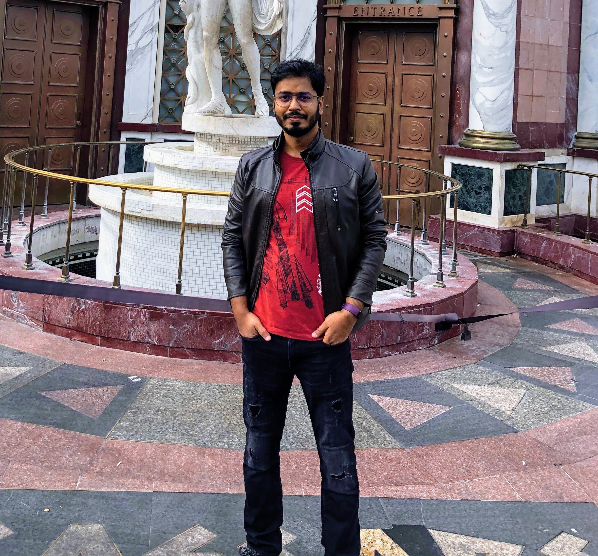

---
# the default layout is 'page'
icon: fas fa-info-circle
order: 4
---

I am a Senior data scientist and author of the book [Deep Learning with PyTorch Lightning](https://www.amazon.com/Deep-Learning-PyTorch-Lightning-high-performance/dp/180056161X). I have a Master of Science in Industrial Engineering and Applied Statistics from Texas A&M University. Shivam has published several research papers, including a patent for NLP, a patent for machine learning, and various blogs. I have extensive experience in machine/deep learning, data processing, feature engineering, model training, and evaluation. My expertise includes AI skills such as Deep Neural Networks for NLP and Computer vision, Large Language Models, and Generative AI. Currently, I am working at IBM in Dallas as a Senior Data Scientist, where I have developed several machine learning models for predictive analytics, recommendation systems, anomaly detection, and Covid-19 risk level prediction across the US Army installations.

